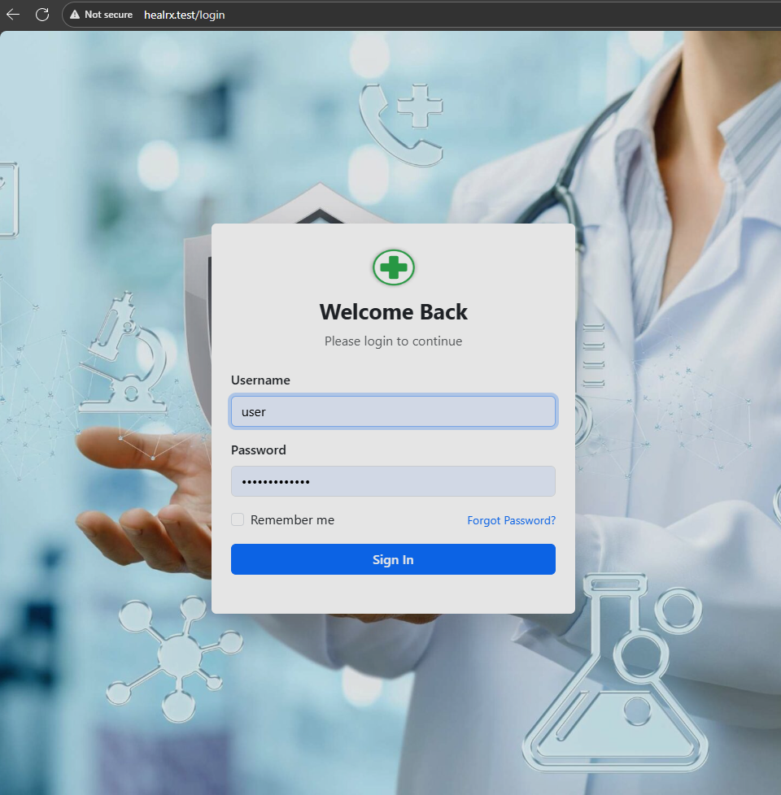
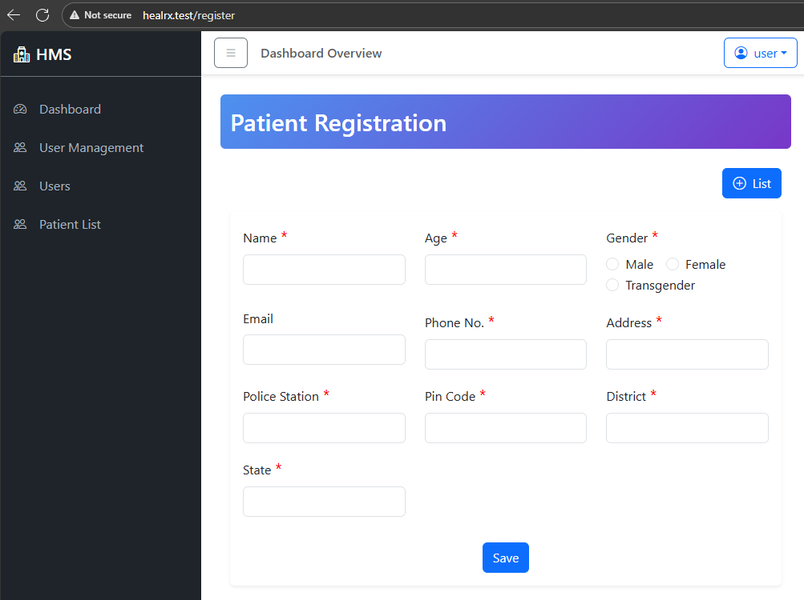

### Docker Setup

run the following commands to start docker

```sh
cp .env.example .env
cp .env.api-example ./api/.env
cp .env.web-example ./web/.env
docker compose up -d mongodb
```


### Create MongoDB User

run the following script using vscode mongodb extension

```js
const database = 'rtcs';
use(database);
db.createUser(
  {
    user: "rtcs",
    pwd: "securePass123",
    roles: [ { role: "readWrite", db: "rtcs" } ]
  }
);
```

### Start Frontend and Backend

```sh
docker compose up -d web
curl --location 'http://api.healrx.test/api/v1/auth/register' \
--header 'Content-Type: application/json' \
--data-raw '{
	"username": "user",
    "email":"user@example.com",
    "password": "Testuser@1234",
    "confirmPassword": "Testuser@1234"
}'
docker compose exec web npm run build
docker compose up -d nginx
```

Open [HealRx](http://api.healrx.test) UI to login






Enjoy!